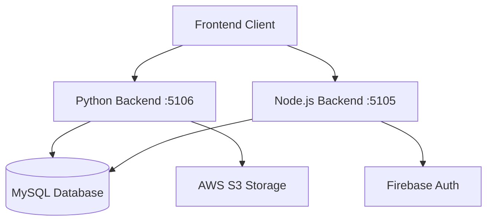

# Pioneer API Documentation

## Table of Contents
1. [Overview](#overview)
2. [System Architecture](#system-architecture)
3. [Authentication](#authentication)
4. [Python Backend API (Port 5106)](#python-backend-api)
   - [Report Processing](#report-processing)
   - [ESG Calculations](#esg-calculations)
   - [Storage Management](#storage-management)
   - [Analysis](#analysis)
5. [Node.js Backend API (Port 5105)](#nodejs-backend-api)
   - [Authentication](#authentication-endpoints)
   - [Data Retrieval](#data-retrieval)
   - [File Management](#file-management)
6. [Data Models](#data-models)
7. [Error Handling](#error-handling)

## Overview

The Pioneer system provides ESG (Environmental, Social, and Governance) analysis and scoring capabilities through two backend servers:

| Server | Port | Primary Functions |
|--------|------|------------------|
| Python Backend (FastAPI) | 5106 | Report processing, ESG calculations |
| Node.js Backend (Express) | 5105 | Authentication, Data retrieval |

## System Architecture



## Python Backend API

### Report Processing

#### Process Report
```http
POST /reports/fetch/{file_name}
```

#### Extract Report Text
```http
POST /reports/extract/text/{report_name}
```

#### Update Report Data
```http
POST /reports/extract/update/data/{report_name}
```

### ESG Calculations

#### Calculate ESG Scores
```http
POST /calculate-esg
```

#### Generate Predictions
```http
POST /predict
```

### Analysis

#### Get Company Analysis
```http
GET /dashboard/analysis/{company_id}
```

### Storage Management

#### Storage Status
```http
GET /storage-status
```

#### Manual Cleanup
```http
POST /cleanup
```

#### Force Cleanup
```http
POST /cleanup/force
```

## Node.js Backend API

### Authentication Endpoints

#### Login
```http
POST /api/login
```

#### Logout
```http
POST /api/logout
```

### Data Retrieval

#### Company Information
```http
GET /api/table/company
```

#### Social Data
```http
GET /api/table/social
```

#### Environmental Score
```http
GET /api/score/environment
```

#### Governance Data
```http
GET /api/table/governance
```

#### ESG Dashboard Data
```http
GET /api/dashboard/esg
```

#### ESG Predictions
```http
GET /api/score/predict
```

### File Management

#### List Storage Files
```http
GET /api/s3/storage/files
```

#### Upload Report
```http
POST /api/firebase/upload
```

## Data Models

### Company Object
```typescript
interface Company {
    CompanyID: number;
    CompanyName: string;
    Industry: string;
    Country: string;
}
```

### ESG Score Object
```typescript
interface ESGScore {
    CompanyName: string;
    CompanyID: number;
    ReportYear: number;
    Environmental_Score: number;
    Social_Score: number;
    Governance_Score: number;
    Final_ESG_score: number;
}
```

### ESG Prediction Object
```typescript
interface ESGPrediction {
    CompanyName: string;
    CompanyID: number;
    Year: number;
    Environmental_Score: number;
    Social_Score: number;
    Governance_Score: number;
    ESG_score: number;
    Data_Type: string;
}
```

## Error Handling

### HTTP Status Codes
| Code | Description | Example |
|------|-------------|---------|
| 200 | Success | Request completed successfully |
| 400 | Bad Request | Invalid parameters |
| 401 | Unauthorized | Invalid or missing token |
| 404 | Not Found | Resource doesn't exist |
| 500 | Server Error | Internal processing error |

### Error Response Format
```json
{
    "status": "error",
    "code": "number",
    "detail": "string",
    "timestamp": "string"
}
```

## Rate Limiting
- Standard endpoints: 100 requests/minute
- Authentication endpoints: 10 requests/minute
- File processing endpoints: 5 requests/minute

## Security
- All endpoints except `/api/login` require JWT authentication
- CORS enabled for `localhost:3000`
- File size limit: 10MB for PDF uploads