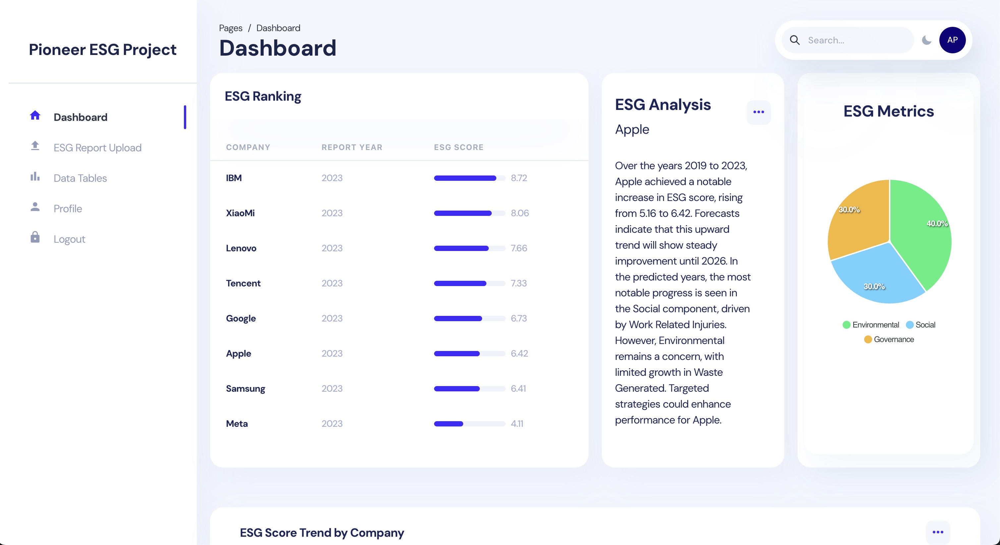
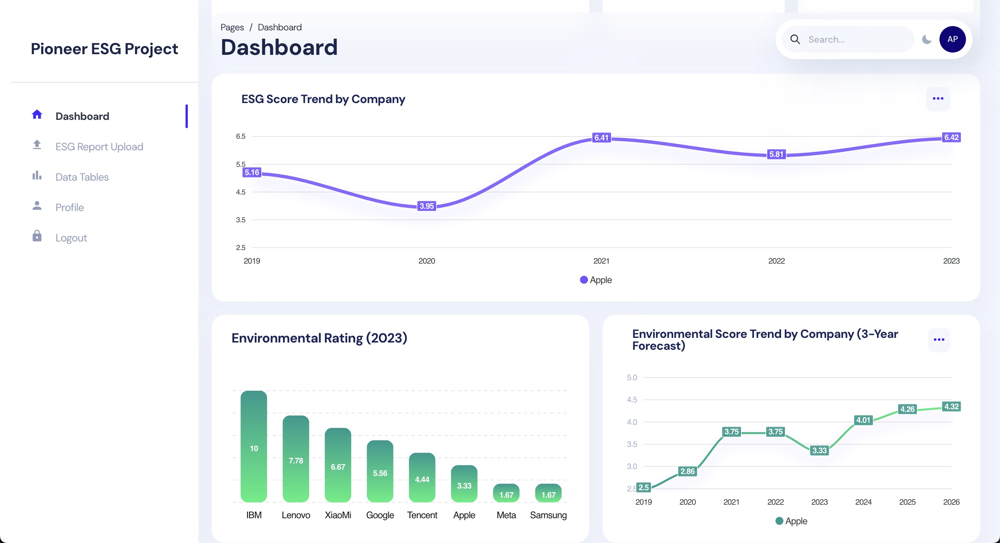
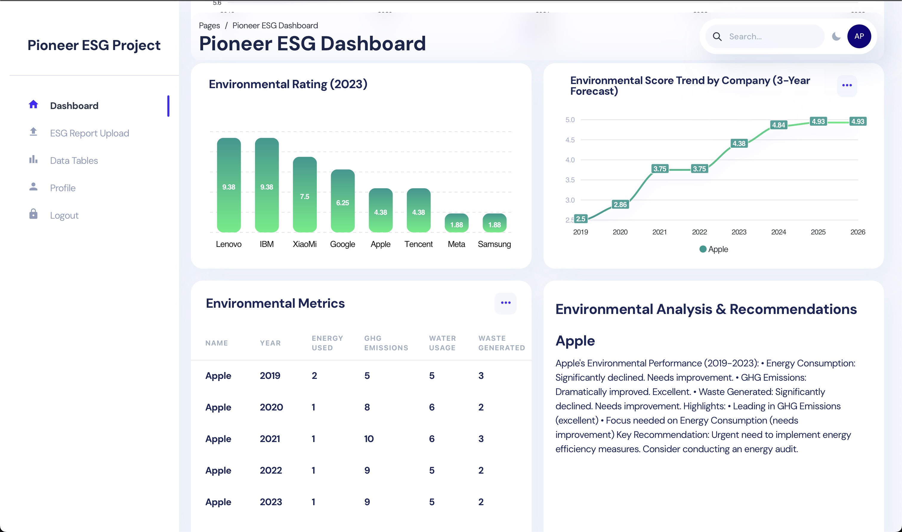

# DSS5105 Pioneer Project - ESG Data Analysis Platform

A comprehensive platform for extracting and analyzing Environmental, Social, and Governance (ESG) data from corporate reports using:

1. Rule-based pattern matching for structured data extraction 
2. RoBERTa-based token classification for identifying ESG-related information
3. Template-based natural language generation for trend analysis 

---

## 📊 Web App Overview



- **ESG Ranking**: Real-time ranking of companies based on their ESG performance scores
- **ESG Analysis & Recommendations**: 
  - Detailed trend analysis with natural language insights about company performance
  - Component-specific analysis highlighting strongest and weakest areas
  - Strategic recommendations for ESG improvement:
    - Environmental: Suggestions for improving energy consumption, emissions, waste management
    - Social: Recommendations for enhancing workforce diversity, safety measures, data security
    - Governance: Guidelines for strengthening board composition, risk management, ethical practices
- **ESG Metrics**: Visual breakdown of Environmental (40%), Social (30%), and Governance (30%) components
- **Interactive Dashboard**: User-friendly interface for exploring ESG data and company comparisons
- **Dynamic Updates**: Real-time score updates and trend analysis
- **Company Selection**: Easy company switching through dropdown menu



- **ESG Score Trend**: Historical and current ESG performance tracking
- **3-Year Forecast in ESG**: Predictive analytics showing future ESG score trajectories
- **Component-Specific Analysis**: Detailed breakdown of environmental, social, and governance metrics
- **Interactive Visualizations**: Dynamic charts and graphs for trend analysis
- **Comparative Analysis**: Tools for benchmarking against industry peers

---
## 🆕 New Updates 



### 🌱 Enhanced Environmental Analytics

The dashboard now includes detailed environmental performance tracking and analysis:

#### 1. 📊 Environmental Metrics Table
- Comprehensive year-by-year tracking of key metrics:
  - ⚡ Energy Consumption
  - 🌫️ GHG Emissions
  - 💧 Water Usage
  - ♻️ Waste Generated
- 🔄 Interactive company selection
- 📈 Sortable metrics for easy comparison

#### 2. 📝 Environmental Analysis & Recommendations
- 📈 Real-time analysis of environmental performance trends
- 🎯 Structured performance breakdown:
  - 📊 Significant Changes: Detailed tracking of metric movements
  - ⭐ Performance Highlights: Identification of strongest and priority areas
  - 💡 Key Recommendations: Actionable insights for improvement
- 📅 Company-specific insights with historical context (2019-2023)
- 🔄 Dynamic updates based on company selection

These new features provide deeper insights into companies' environmental performance and offer actionable recommendations for sustainability improvements.

---

> 📚 **Documentation**
> - For detailed information visit our [Wiki Page](https://github.com/ZS-nus/DSS5105_Pioneer_Project/wiki)
> - For API endpoints and usage, see our [API Documentation](https://github.com/ZS-nus/DSS5105_Pioneer_Project/wiki/API-Documentation)

---


### Technical Stack

#### Frontend
- React.js with Chakra UI
- Interactive data visualization
- Real-time ESG score updates
- Company comparison tools
- Responsive dashboard design

#### Backend Services
1. **Node.js Backend**
   - RESTful API endpoints
   - Database management
   - Authentication services
   - Real-time data processing

2. **Python Backend (FastAPI)**
   - NLP processing engine
   - BERT model integration
   - PDF text extraction
   - ESG scoring algorithms

---

### Infrastructure
- Docker containerization
- GPU acceleration support
- AWS cloud deployment
- Firebase integration
- MySQL database

---


## 🏗 Project Structure tree

```
pioneer/
├── python/ # Python Backend (FastAPI)
│ ├── Dockerfile # Python service container
│ ├── Dockerfile.nvidia # NVIDIA GPU support
│ ├── requirements.txt # Python dependencies
│ └── main.py # FastAPI application
│
├── groupA/ # NLP Processing Module
│ ├── README.md # NLP workflow documentation
│ ├── requirements.txt # Python NLP dependencies
│ ├── main.py # NLP processing script
│ └── notebooks/ # Jupyter notebooks for NLP
│
├── groupB/
│ └── dashboard/
│ ├── client/ # React Frontend
│ │ ├── Dockerfile # Frontend container
│ │ └── package.json # Node.js dependencies
│ │
│ └── server/ # Node.js Backend
│ ├── Dockerfile # Node.js service container
│ └── package.json # Node.js dependencies
│
├── .gitignore # Git ignore rules
├── .env # Environment variables
├── docker-compose.yml # Root level container orchestration
├── docker-compose.nvidia.yml # Root level GPU container setup
├── README.md # Project documentation
└── requirements.txt # Global Python dependencies
```

---

## 🚀 Quick Start

### Login Credentials 🔐

```
Email: admin@pioneer.com
Password: 123456
```

### Prerequisites
- Docker & Docker Compose
- Node.js >= 20.0
- Python >= 3.12.5
- NVIDIA drivers (for GPU support)

---

### Option 1: Docker Compose (Recommended) 🐳

#### For CPU systems
```
docker-compose up -d
```

#### For NVIDIA GPU systems
```
docker-compose -f docker-compose.nvidia.yml up -d
```

---

### Option 2: Docker Build 🏗️

#### Build React Frontend
bash

```
cd groupB/dashboard/client

docker build -t pioneer-frontend .

docker run -d \
  --name pioneer-client \
  -p 3000:3000 \
  -e REACT_APP_API_URL=http://localhost:5106 \
  pioneer-client
```

#### Build Node.js Backend
bash

```
cd groupB/dashboard/server

docker build -t pioneer-server-1 .

docker run -d \
--name pioneer-server-1 \
-p 5105:5105 \
-v "$(pwd)/pioneer_key.json:/usr/src/app/pioneer_key.json" \
--env-file .env \
--log-driver json-file \
--log-opt max-size=10m \
pioneer-server-1
```

#### Build Python Backend

bash

```
docker build -t pioneer-server-2 .

docker run -d \
  --name pioneer-server-2 \
  --gpus all \
  -p 5106:5106 \
  pioneer-server-2
```

#### Stop and Remove Containers

bash

```
docker stop pioneer-client pioneer-server-1 pioneer-server-2
docker rmi pioneer-frontend pioneer-server-1 pioneer-server-2
```

---

### Option 3: Traditional Setup (Development) 💻

#### 1. Python Backend Setup

First, clone the repository and set up the Python environment:


##### Create and activate virtual environment

```
python -m venv venv
```

##### For macOS/Linux
```
source venv/bin/activate
```

##### for windows
```
.\venv\Scripts\Activate
```

##### Install dependencies
```
pip install -r requirements.txt
```

##### Quit the venv
```
deactivate
```

#### 1. Start Python server
```
python main.py
```


#### 2. Node.js Backend Setup
Open a new terminal and set up the Node.js backend:
```
cd groupB/dashboard/server
npm install
npm start
```


#### 3. React Frontend Setup
Open another terminal for the frontend:

```
cd groupB/dashboard/client
npm install
npm start
```
The frontend will automatically open at http://localhost:3000

#### 4. Verify Installation

| Service | URL |
|---------|-----|
| Frontend | http://localhost:3000 |
| Node.js API | http://localhost:5105 |
| Python API | http://localhost:5106 |

---


